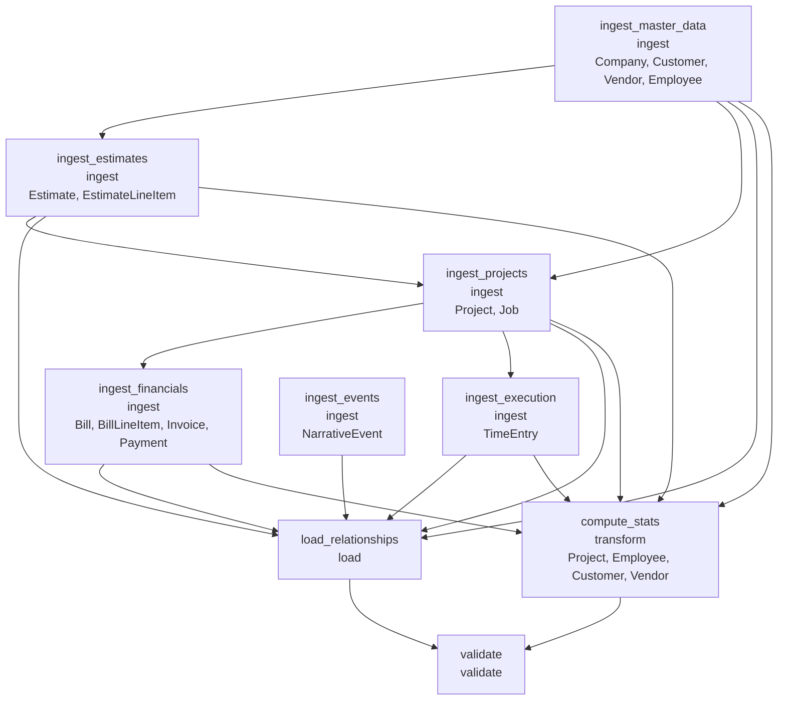

# ETL Pipeline Specification — Ridgeline Builders

Generated from `runs/ridgeline_20260318/phase_3_architecture/etl_architecture.yaml` on 2026-03-18

## Overview

| Attribute | Value |
|-----------|-------|
| **Company** | Ridgeline Builders |
| **Neo4j target** | 5.x |
| **Pipeline stages** | 9 |
| **Source pipelines** | 16 |
| **Entity types loaded** | 14 |
| **Relationship types created** | 14 |
| **Estimated total rows** | 10,270 |
| **Mapping plan** | `runs/ridgeline_20260318/phase_2_mapping/mapping_plan.yaml` |

This pipeline reads 16 CSV source files, transforms and loads them into a Neo4j 5.x graph database containing 14 node types and 14 relationship types. All loads use idempotent MERGE operations.

## Pipeline Execution Order



| Stage | Type | Depends On | Entity Types | Est. Rows |
|-------|------|-----------|--------------|-----------|
| ingest_master_data | ingest | — | Company, Customer, Vendor, Employee | 29 |
| ingest_estimates | ingest | ingest_master_data | Estimate, EstimateLineItem | 1,273 |
| ingest_projects | ingest | ingest_master_data, ingest_estimates | Project, Job | 330 |
| ingest_financials | ingest | ingest_projects | Bill, BillLineItem, Invoice, Payment | 1,758 |
| ingest_execution | ingest | ingest_projects | TimeEntry | 1,710 |
| ingest_events | ingest | — | NarrativeEvent | 3 |
| load_relationships | load | ingest_master_data, ingest_estimates, ingest_projects, ingest_financials, ingest_execution, ingest_events | — | 5,088 |
| compute_stats | transform | ingest_master_data, ingest_estimates, ingest_projects, ingest_financials, ingest_execution | Project, Employee, Customer, Vendor | 79 |
| validate | validate | load_relationships, compute_stats | — | 0 |

## Neo4j Schema

### Constraints

| Type | Label | Property | Cypher |
|------|-------|----------|--------|
| uniqueness | Company | `name` | `CREATE CONSTRAINT uniq_company_name IF NOT EXISTS FOR (n:Company) REQUIRE n.name IS UNIQUE;` |
| uniqueness | Customer | `id` | `CREATE CONSTRAINT uniq_customer_id IF NOT EXISTS FOR (n:Customer) REQUIRE n.id IS UNIQUE;` |
| uniqueness | Vendor | `id` | `CREATE CONSTRAINT uniq_vendor_id IF NOT EXISTS FOR (n:Vendor) REQUIRE n.id IS UNIQUE;` |
| uniqueness | Employee | `id` | `CREATE CONSTRAINT uniq_employee_id IF NOT EXISTS FOR (n:Employee) REQUIRE n.id IS UNIQUE;` |
| uniqueness | Estimate | `estimate_id` | `CREATE CONSTRAINT uniq_estimate_estimate_id IF NOT EXISTS FOR (n:Estimate) REQUIRE n.estimate_id IS UNIQUE;` |
| uniqueness | EstimateLineItem | `line_id` | `CREATE CONSTRAINT uniq_estimatelineitem_line_id IF NOT EXISTS FOR (n:EstimateLineItem) REQUIRE n.line_id IS UNIQUE;` |
| uniqueness | Project | `project_id` | `CREATE CONSTRAINT uniq_project_project_id IF NOT EXISTS FOR (n:Project) REQUIRE n.project_id IS UNIQUE;` |
| uniqueness | Job | `job_id` | `CREATE CONSTRAINT uniq_job_job_id IF NOT EXISTS FOR (n:Job) REQUIRE n.job_id IS UNIQUE;` |
| uniqueness | TimeEntry | `entry_id` | `CREATE CONSTRAINT uniq_timeentry_entry_id IF NOT EXISTS FOR (n:TimeEntry) REQUIRE n.entry_id IS UNIQUE;` |
| uniqueness | Bill | `bill_id` | `CREATE CONSTRAINT uniq_bill_bill_id IF NOT EXISTS FOR (n:Bill) REQUIRE n.bill_id IS UNIQUE;` |
| uniqueness | BillLineItem | `line_id` | `CREATE CONSTRAINT uniq_billlineitem_line_id IF NOT EXISTS FOR (n:BillLineItem) REQUIRE n.line_id IS UNIQUE;` |
| uniqueness | Invoice | `invoice_id` | `CREATE CONSTRAINT uniq_invoice_invoice_id IF NOT EXISTS FOR (n:Invoice) REQUIRE n.invoice_id IS UNIQUE;` |
| uniqueness | Payment | `payment_id` | `CREATE CONSTRAINT uniq_payment_payment_id IF NOT EXISTS FOR (n:Payment) REQUIRE n.payment_id IS UNIQUE;` |
| uniqueness | NarrativeEvent | `event_id` | `CREATE CONSTRAINT uniq_narrativeevent_event_id IF NOT EXISTS FOR (n:NarrativeEvent) REQUIRE n.event_id IS UNIQUE;` |

### Indexes

| Label | Properties | Type | Cypher |
|-------|-----------|------|--------|
| Company | `owner_name` | btree | `CREATE INDEX idx_company_owner_name IF NOT EXISTS FOR (n:Company) ON (n.owner_name);` |
| Customer | `name` | btree | `CREATE INDEX idx_customer_name IF NOT EXISTS FOR (n:Customer) ON (n.name);` |
| Customer | `type` | btree | `CREATE INDEX idx_customer_type IF NOT EXISTS FOR (n:Customer) ON (n.type);` |
| Customer | `status` | btree | `CREATE INDEX idx_customer_status IF NOT EXISTS FOR (n:Customer) ON (n.status);` |
| Customer | `created_at` | range | `CREATE INDEX idx_customer_created_at IF NOT EXISTS FOR (n:Customer) ON (n.created_at);` |
| Vendor | `name` | btree | `CREATE INDEX idx_vendor_name IF NOT EXISTS FOR (n:Vendor) ON (n.name);` |
| Vendor | `type` | btree | `CREATE INDEX idx_vendor_type IF NOT EXISTS FOR (n:Vendor) ON (n.type);` |
| Vendor | `insurance_expiry` | range | `CREATE INDEX idx_vendor_insurance_expiry IF NOT EXISTS FOR (n:Vendor) ON (n.insurance_expiry);` |
| Vendor | `account_opened` | range | `CREATE INDEX idx_vendor_account_opened IF NOT EXISTS FOR (n:Vendor) ON (n.account_opened);` |
| Employee | `name` | btree | `CREATE INDEX idx_employee_name IF NOT EXISTS FOR (n:Employee) ON (n.name);` |
| Employee | `status` | btree | `CREATE INDEX idx_employee_status IF NOT EXISTS FOR (n:Employee) ON (n.status);` |
| Employee | `hire_date` | range | `CREATE INDEX idx_employee_hire_date IF NOT EXISTS FOR (n:Employee) ON (n.hire_date);` |
| Employee | `termination_date` | range | `CREATE INDEX idx_employee_termination_date IF NOT EXISTS FOR (n:Employee) ON (n.termination_date);` |
| Estimate | `archetype` | btree | `CREATE INDEX idx_estimate_archetype IF NOT EXISTS FOR (n:Estimate) ON (n.archetype);` |
| Estimate | `status` | btree | `CREATE INDEX idx_estimate_status IF NOT EXISTS FOR (n:Estimate) ON (n.status);` |
| Estimate | `created_at` | range | `CREATE INDEX idx_estimate_created_at IF NOT EXISTS FOR (n:Estimate) ON (n.created_at);` |
| Estimate | `sent_at` | range | `CREATE INDEX idx_estimate_sent_at IF NOT EXISTS FOR (n:Estimate) ON (n.sent_at);` |
| Estimate | `valid_until` | range | `CREATE INDEX idx_estimate_valid_until IF NOT EXISTS FOR (n:Estimate) ON (n.valid_until);` |
| Estimate | `accepted_at` | range | `CREATE INDEX idx_estimate_accepted_at IF NOT EXISTS FOR (n:Estimate) ON (n.accepted_at);` |
| Project | `name` | btree | `CREATE INDEX idx_project_name IF NOT EXISTS FOR (n:Project) ON (n.name);` |
| Project | `archetype` | btree | `CREATE INDEX idx_project_archetype IF NOT EXISTS FOR (n:Project) ON (n.archetype);` |
| Project | `type` | btree | `CREATE INDEX idx_project_type IF NOT EXISTS FOR (n:Project) ON (n.type);` |
| Project | `status` | btree | `CREATE INDEX idx_project_status IF NOT EXISTS FOR (n:Project) ON (n.status);` |
| Project | `start_date` | range | `CREATE INDEX idx_project_start_date IF NOT EXISTS FOR (n:Project) ON (n.start_date);` |
| Project | `end_date` | range | `CREATE INDEX idx_project_end_date IF NOT EXISTS FOR (n:Project) ON (n.end_date);` |
| Project | `actual_start` | range | `CREATE INDEX idx_project_actual_start IF NOT EXISTS FOR (n:Project) ON (n.actual_start);` |
| Project | `actual_end` | range | `CREATE INDEX idx_project_actual_end IF NOT EXISTS FOR (n:Project) ON (n.actual_end);` |
| Project | `contract_type` | btree | `CREATE INDEX idx_project_contract_type IF NOT EXISTS FOR (n:Project) ON (n.contract_type);` |
| Job | `name` | btree | `CREATE INDEX idx_job_name IF NOT EXISTS FOR (n:Job) ON (n.name);` |
| Job | `status` | btree | `CREATE INDEX idx_job_status IF NOT EXISTS FOR (n:Job) ON (n.status);` |
| Job | `sub_vendor_type` | btree | `CREATE INDEX idx_job_sub_vendor_type IF NOT EXISTS FOR (n:Job) ON (n.sub_vendor_type);` |
| Job | `actual_start` | range | `CREATE INDEX idx_job_actual_start IF NOT EXISTS FOR (n:Job) ON (n.actual_start);` |
| Job | `actual_end` | range | `CREATE INDEX idx_job_actual_end IF NOT EXISTS FOR (n:Job) ON (n.actual_end);` |
| TimeEntry | `date` | range | `CREATE INDEX idx_timeentry_date IF NOT EXISTS FOR (n:TimeEntry) ON (n.date);` |
| Bill | `status` | btree | `CREATE INDEX idx_bill_status IF NOT EXISTS FOR (n:Bill) ON (n.status);` |
| Bill | `received_date` | range | `CREATE INDEX idx_bill_received_date IF NOT EXISTS FOR (n:Bill) ON (n.received_date);` |
| Bill | `due_date` | range | `CREATE INDEX idx_bill_due_date IF NOT EXISTS FOR (n:Bill) ON (n.due_date);` |
| Bill | `paid_date` | range | `CREATE INDEX idx_bill_paid_date IF NOT EXISTS FOR (n:Bill) ON (n.paid_date);` |
| Invoice | `type` | btree | `CREATE INDEX idx_invoice_type IF NOT EXISTS FOR (n:Invoice) ON (n.type);` |
| Invoice | `status` | btree | `CREATE INDEX idx_invoice_status IF NOT EXISTS FOR (n:Invoice) ON (n.status);` |
| Invoice | `issued_date` | range | `CREATE INDEX idx_invoice_issued_date IF NOT EXISTS FOR (n:Invoice) ON (n.issued_date);` |
| Invoice | `due_date` | range | `CREATE INDEX idx_invoice_due_date IF NOT EXISTS FOR (n:Invoice) ON (n.due_date);` |
| Payment | `received_date` | range | `CREATE INDEX idx_payment_received_date IF NOT EXISTS FOR (n:Payment) ON (n.received_date);` |
| Payment | `deposited_date` | range | `CREATE INDEX idx_payment_deposited_date IF NOT EXISTS FOR (n:Payment) ON (n.deposited_date);` |
| NarrativeEvent | `event_type` | btree | `CREATE INDEX idx_narrativeevent_event_type IF NOT EXISTS FOR (n:NarrativeEvent) ON (n.event_type);` |
| NarrativeEvent | `date` | range | `CREATE INDEX idx_narrativeevent_date IF NOT EXISTS FOR (n:NarrativeEvent) ON (n.date);` |

## Source Pipelines

### company.csv → Company

**Reader**

| Setting | Value |
|---------|-------|
| Connection | file |
| Format | csv |
| Delimiter | `,` |
| Encoding | utf-8 |
| Header row | 0 |

**Preprocessing**

*type_coerce*: No date or numeric fields require coercion for this source.

**Entity Extraction**

| Entity Type | ID Expression | Filter |
|-------------|--------------|--------|
| Company | `row.name` | — |

**Relationship Extraction**

| Relationship | From Expression | To Expression |
|-------------|----------------|---------------|
| COMPANY_EMPLOYS | `row.name` | `row.owner_employee_id` |

**Load Strategy**

| Setting | Value |
|---------|-------|
| Upsert mode | merge |
| Merge keys | `name` |
| On parse error | quarantine |
| On constraint violation | skip_row |
| Quarantine path | `runs/ridgeline_20260318/quarantine/` |

---

### customer.csv → Customer

**Reader**

| Setting | Value |
|---------|-------|
| Connection | file |
| Format | csv |
| Delimiter | `,` |
| Encoding | utf-8 |
| Header row | 0 |

**Preprocessing**

*type_coerce*: Cast created_at to ISO-8601 date. Cast credit_limit to float. Cast tax_exempt to boolean.

| Field | Target Type / Method |
|-------|---------------------|
| `created_at` | date |
| `credit_limit` | float |
| `tax_exempt` | boolean |

*normalize*: Normalize status enum to lowercase (active, inactive).

| Field | Target Type / Method |
|-------|---------------------|
| `status` | lowercase |

**Entity Extraction**

| Entity Type | ID Expression | Filter |
|-------------|--------------|--------|
| Customer | `row.id` | — |

**Load Strategy**

| Setting | Value |
|---------|-------|
| Upsert mode | merge |
| Merge keys | `id` |
| On parse error | quarantine |
| On constraint violation | skip_row |
| Quarantine path | `runs/ridgeline_20260318/quarantine/` |

---

### vendor.csv → Vendor

**Reader**

| Setting | Value |
|---------|-------|
| Connection | file |
| Format | csv |
| Delimiter | `,` |
| Encoding | utf-8 |
| Header row | 0 |

**Preprocessing**

*type_coerce*: Cast insurance_expiry and account_opened to ISO-8601 date. Cast credit_limit to float. Cast rating to integer. Cast w9_on_file to boolean.

| Field | Target Type / Method |
|-------|---------------------|
| `insurance_expiry` | date |
| `account_opened` | date |
| `credit_limit` | float |
| `rating` | integer |
| `w9_on_file` | boolean |

*normalize*: Normalize type and payment_terms enums to lowercase.

| Field | Target Type / Method |
|-------|---------------------|
| `type` | lowercase |
| `payment_terms` | lowercase |

**Entity Extraction**

| Entity Type | ID Expression | Filter |
|-------------|--------------|--------|
| Vendor | `row.id` | — |

**Load Strategy**

| Setting | Value |
|---------|-------|
| Upsert mode | merge |
| Merge keys | `id` |
| On parse error | quarantine |
| On constraint violation | skip_row |
| Quarantine path | `runs/ridgeline_20260318/quarantine/` |

---

### employee.csv → Employee

**Reader**

| Setting | Value |
|---------|-------|
| Connection | file |
| Format | csv |
| Delimiter | `,` |
| Encoding | utf-8 |
| Header row | 0 |

**Preprocessing**

*type_coerce*: Cast hire_date and termination_date to ISO-8601 date. Cast base_rate, burden_rate, bill_rate to float.

| Field | Target Type / Method |
|-------|---------------------|
| `hire_date` | date |
| `termination_date` | date |
| `base_rate` | float |
| `burden_rate` | float |
| `bill_rate` | float |

*normalize*: Normalize status enum to lowercase (active, terminated).

| Field | Target Type / Method |
|-------|---------------------|
| `status` | lowercase |

**Entity Extraction**

| Entity Type | ID Expression | Filter |
|-------------|--------------|--------|
| Employee | `row.id` | — |

**Load Strategy**

| Setting | Value |
|---------|-------|
| Upsert mode | merge |
| Merge keys | `id` |
| On parse error | quarantine |
| On constraint violation | skip_row |
| Quarantine path | `runs/ridgeline_20260318/quarantine/` |

---

### estimate.csv → Estimate

**Reader**

| Setting | Value |
|---------|-------|
| Connection | file |
| Format | csv |
| Delimiter | `,` |
| Encoding | utf-8 |
| Header row | 0 |

**Preprocessing**

*type_coerce*: Cast created_at, sent_at, valid_until, accepted_at to ISO-8601 date. Cast total, cost_estimate, markup_pct, tax_amount to float. Cast version to integer.

| Field | Target Type / Method |
|-------|---------------------|
| `created_at` | date |
| `sent_at` | date |
| `valid_until` | date |
| `accepted_at` | date |
| `total` | float |
| `cost_estimate` | float |
| `markup_pct` | float |
| `tax_amount` | float |
| `version` | integer |

*normalize*: Normalize status and archetype enums to lowercase.

| Field | Target Type / Method |
|-------|---------------------|
| `status` | lowercase |
| `archetype` | lowercase |

**Entity Extraction**

| Entity Type | ID Expression | Filter |
|-------------|--------------|--------|
| Estimate | `row.estimate_id` | — |

**Relationship Extraction**

| Relationship | From Expression | To Expression |
|-------------|----------------|---------------|
| CUSTOMER_HAS_ESTIMATE | `row.customer_id` | `row.estimate_id` |
| ESTIMATE_BECOMES_PROJECT | `row.estimate_id` | `row.project_id` |

**Load Strategy**

| Setting | Value |
|---------|-------|
| Upsert mode | merge |
| Merge keys | `estimate_id` |
| On parse error | quarantine |
| On constraint violation | skip_row |
| Quarantine path | `runs/ridgeline_20260318/quarantine/` |

---

### estimate_line_item.csv → EstimateLineItem

**Reader**

| Setting | Value |
|---------|-------|
| Connection | file |
| Format | csv |
| Delimiter | `,` |
| Encoding | utf-8 |
| Header row | 0 |

**Preprocessing**

*type_coerce*: Cast quantity to float. Cast unit_cost, unit_price, line_total to float.

| Field | Target Type / Method |
|-------|---------------------|
| `quantity` | float |
| `unit_cost` | float |
| `unit_price` | float |
| `line_total` | float |

*normalize*: Normalize category enum to lowercase.

| Field | Target Type / Method |
|-------|---------------------|
| `category` | lowercase |

**Entity Extraction**

| Entity Type | ID Expression | Filter |
|-------------|--------------|--------|
| EstimateLineItem | `row.line_id` | — |

**Relationship Extraction**

| Relationship | From Expression | To Expression |
|-------------|----------------|---------------|
| ESTIMATE_HAS_LINE_ITEM | `row.estimate_id` | `row.line_id` |
| ESTIMATE_LINE_ITEM_MAPS_TO_JOB | `row.line_id` | `row.cost_code` |

**Load Strategy**

| Setting | Value |
|---------|-------|
| Upsert mode | merge |
| Merge keys | `line_id` |
| On parse error | quarantine |
| On constraint violation | skip_row |
| Quarantine path | `runs/ridgeline_20260318/quarantine/` |

---

### project.csv → Project

**Reader**

| Setting | Value |
|---------|-------|
| Connection | file |
| Format | csv |
| Delimiter | `,` |
| Encoding | utf-8 |
| Header row | 0 |

**Preprocessing**

*type_coerce*: Cast start_date, end_date, actual_start, actual_end to ISO-8601 date. Cast contract_amount, markup_pct, retention_pct to float. Cast retention_released, permit_required to boolean.

| Field | Target Type / Method |
|-------|---------------------|
| `start_date` | date |
| `end_date` | date |
| `actual_start` | date |
| `actual_end` | date |
| `contract_amount` | float |
| `markup_pct` | float |
| `retention_pct` | float |
| `retention_released` | boolean |
| `permit_required` | boolean |

*normalize*: Normalize status, archetype, type, contract_type enums to lowercase.

| Field | Target Type / Method |
|-------|---------------------|
| `status` | lowercase |
| `archetype` | lowercase |
| `type` | lowercase |
| `contract_type` | lowercase |

**Entity Extraction**

| Entity Type | ID Expression | Filter |
|-------------|--------------|--------|
| Project | `row.project_id` | — |

**Relationship Extraction**

| Relationship | From Expression | To Expression |
|-------------|----------------|---------------|
| CUSTOMER_HAS_PROJECT | `row.customer_id` | `row.project_id` |
| ESTIMATE_BECOMES_PROJECT | `row.estimate_id` | `row.project_id` |

**Load Strategy**

| Setting | Value |
|---------|-------|
| Upsert mode | merge |
| Merge keys | `project_id` |
| On parse error | quarantine |
| On constraint violation | skip_row |
| Quarantine path | `runs/ridgeline_20260318/quarantine/` |

---

### job → Job

**Reader**

| Setting | Value |
|---------|-------|
| Connection | file |
| Format | csv |
| Delimiter | `,` |
| Encoding | utf-8 |
| Header row | 0 |

**Preprocessing**

*type_coerce*: Cast actual_start, actual_end to ISO-8601 date. Cast budgeted_labor_hours, budgeted_labor_cost, budgeted_material_cost, budgeted_sub_cost, budgeted_equipment_cost, budgeted_other_cost to float. Cast sort_order to integer.

| Field | Target Type / Method |
|-------|---------------------|
| `actual_start` | date |
| `actual_end` | date |
| `budgeted_labor_hours` | float |
| `budgeted_labor_cost` | float |
| `budgeted_material_cost` | float |
| `budgeted_sub_cost` | float |
| `budgeted_equipment_cost` | float |
| `budgeted_other_cost` | float |
| `sort_order` | integer |

*normalize*: Normalize status enum to lowercase.

| Field | Target Type / Method |
|-------|---------------------|
| `status` | lowercase |

**Entity Extraction**

| Entity Type | ID Expression | Filter |
|-------------|--------------|--------|
| Job | `row.job_id` | — |

**Relationship Extraction**

| Relationship | From Expression | To Expression |
|-------------|----------------|---------------|
| PROJECT_HAS_JOB | `row.project_id` | `row.job_id` |

**Load Strategy**

| Setting | Value |
|---------|-------|
| Upsert mode | merge |
| Merge keys | `job_id` |
| On parse error | quarantine |
| On constraint violation | skip_row |
| Quarantine path | `runs/ridgeline_20260318/quarantine/` |

---

### time_entry.csv → TimeEntry

**Reader**

| Setting | Value |
|---------|-------|
| Connection | file |
| Format | csv |
| Delimiter | `,` |
| Encoding | utf-8 |
| Header row | 0 |

**Preprocessing**

*type_coerce*: Cast date to ISO-8601 date. Cast hours_regular, hours_overtime, cost to float.

| Field | Target Type / Method |
|-------|---------------------|
| `date` | date |
| `hours_regular` | float |
| `hours_overtime` | float |
| `cost` | float |

**Entity Extraction**

| Entity Type | ID Expression | Filter |
|-------------|--------------|--------|
| TimeEntry | `row.entry_id` | — |

**Relationship Extraction**

| Relationship | From Expression | To Expression |
|-------------|----------------|---------------|
| JOB_HAS_TIME_ENTRY | `row.job_id` | `row.entry_id` |
| EMPLOYEE_LOGS_TIME | `row.employee_id` | `row.entry_id` |

**Load Strategy**

| Setting | Value |
|---------|-------|
| Upsert mode | merge |
| Merge keys | `entry_id` |
| On parse error | quarantine |
| On constraint violation | skip_row |
| Quarantine path | `runs/ridgeline_20260318/quarantine/` |

---

### bill.csv → Bill

**Reader**

| Setting | Value |
|---------|-------|
| Connection | file |
| Format | csv |
| Delimiter | `,` |
| Encoding | utf-8 |
| Header row | 0 |

**Preprocessing**

*type_coerce*: Cast received_date, due_date, paid_date to ISO-8601 date. Cast total to float.

| Field | Target Type / Method |
|-------|---------------------|
| `received_date` | date |
| `due_date` | date |
| `paid_date` | date |
| `total` | float |

*normalize*: Normalize status and category enums to lowercase.

| Field | Target Type / Method |
|-------|---------------------|
| `status` | lowercase |
| `category` | lowercase |

**Entity Extraction**

| Entity Type | ID Expression | Filter |
|-------------|--------------|--------|
| Bill | `row.bill_id` | — |

**Relationship Extraction**

| Relationship | From Expression | To Expression |
|-------------|----------------|---------------|
| VENDOR_HAS_BILL | `row.vendor_id` | `row.bill_id` |
| PROJECT_HAS_BILL | `row.project_id` | `row.bill_id` |
| JOB_HAS_BILL | `row.job_id` | `row.bill_id` |

**Load Strategy**

| Setting | Value |
|---------|-------|
| Upsert mode | merge |
| Merge keys | `bill_id` |
| On parse error | quarantine |
| On constraint violation | skip_row |
| Quarantine path | `runs/ridgeline_20260318/quarantine/` |

---

### bill_line_item.csv → BillLineItem

**Reader**

| Setting | Value |
|---------|-------|
| Connection | file |
| Format | csv |
| Delimiter | `,` |
| Encoding | utf-8 |
| Header row | 0 |

**Preprocessing**

*type_coerce*: Cast quantity, unit_cost, line_total to float.

| Field | Target Type / Method |
|-------|---------------------|
| `quantity` | float |
| `unit_cost` | float |
| `line_total` | float |

*normalize*: Normalize category enum to lowercase.

| Field | Target Type / Method |
|-------|---------------------|
| `category` | lowercase |

**Entity Extraction**

| Entity Type | ID Expression | Filter |
|-------------|--------------|--------|
| BillLineItem | `row.line_id` | — |

**Load Strategy**

| Setting | Value |
|---------|-------|
| Upsert mode | merge |
| Merge keys | `line_id` |
| On parse error | quarantine |
| On constraint violation | skip_row |
| Quarantine path | `runs/ridgeline_20260318/quarantine/` |

---

### invoice.csv → Invoice

**Reader**

| Setting | Value |
|---------|-------|
| Connection | file |
| Format | csv |
| Delimiter | `,` |
| Encoding | utf-8 |
| Header row | 0 |

**Preprocessing**

*type_coerce*: Cast issued_date, due_date to ISO-8601 date. Cast subtotal, retention_held, tax, total_due to float.

| Field | Target Type / Method |
|-------|---------------------|
| `issued_date` | date |
| `due_date` | date |
| `subtotal` | float |
| `retention_held` | float |
| `tax` | float |
| `total_due` | float |

*normalize*: Normalize type and status enums to lowercase.

| Field | Target Type / Method |
|-------|---------------------|
| `type` | lowercase |
| `status` | lowercase |

**Entity Extraction**

| Entity Type | ID Expression | Filter |
|-------------|--------------|--------|
| Invoice | `row.invoice_id` | — |

**Relationship Extraction**

| Relationship | From Expression | To Expression |
|-------------|----------------|---------------|
| PROJECT_HAS_INVOICE | `row.project_id` | `row.invoice_id` |

**Load Strategy**

| Setting | Value |
|---------|-------|
| Upsert mode | merge |
| Merge keys | `invoice_id` |
| On parse error | quarantine |
| On constraint violation | skip_row |
| Quarantine path | `runs/ridgeline_20260318/quarantine/` |

---

### payment.csv → Payment

**Reader**

| Setting | Value |
|---------|-------|
| Connection | file |
| Format | csv |
| Delimiter | `,` |
| Encoding | utf-8 |
| Header row | 0 |

**Preprocessing**

*type_coerce*: Cast received_date, deposited_date to ISO-8601 date. Cast amount to float.

| Field | Target Type / Method |
|-------|---------------------|
| `received_date` | date |
| `deposited_date` | date |
| `amount` | float |

**Entity Extraction**

| Entity Type | ID Expression | Filter |
|-------------|--------------|--------|
| Payment | `row.payment_id` | — |

**Relationship Extraction**

| Relationship | From Expression | To Expression |
|-------------|----------------|---------------|
| INVOICE_HAS_PAYMENT | `row.invoice_id` | `row.payment_id` |

**Load Strategy**

| Setting | Value |
|---------|-------|
| Upsert mode | merge |
| Merge keys | `payment_id` |
| On parse error | quarantine |
| On constraint violation | skip_row |
| Quarantine path | `runs/ridgeline_20260318/quarantine/` |

---

### loc_event.csv → NarrativeEvent

**Reader**

| Setting | Value |
|---------|-------|
| Connection | file |
| Format | csv |
| Delimiter | `,` |
| Encoding | utf-8 |
| Header row | 0 |

**Preprocessing**

*type_coerce*: Cast date to ISO-8601 date. Cast amount to float.

| Field | Target Type / Method |
|-------|---------------------|
| `date` | date |
| `amount` | float |

*type_coerce*: Derive event_type as literal 'loc_draw' for all rows in this source.

**Entity Extraction**

| Entity Type | ID Expression | Filter |
|-------------|--------------|--------|
| NarrativeEvent | `row.event_id` | — |

**Load Strategy**

| Setting | Value |
|---------|-------|
| Upsert mode | merge |
| Merge keys | `event_id` |
| On parse error | quarantine |
| On constraint violation | skip_row |
| Quarantine path | `runs/ridgeline_20260318/quarantine/` |

---

### overtime_event.csv → NarrativeEvent

**Reader**

| Setting | Value |
|---------|-------|
| Connection | file |
| Format | csv |
| Delimiter | `,` |
| Encoding | utf-8 |
| Header row | 0 |

**Preprocessing**

*type_coerce*: Cast start_date to ISO-8601 date (mapped to NarrativeEvent.date). Cast duration_weeks and ot_hours_per_week_per_person to integer.

| Field | Target Type / Method |
|-------|---------------------|
| `start_date` | date |
| `duration_weeks` | integer |
| `ot_hours_per_week_per_person` | integer |

*type_coerce*: JSON-encode event_metadata from duration_weeks, ot_hours_per_week_per_person, affected_employees.

**Entity Extraction**

| Entity Type | ID Expression | Filter |
|-------------|--------------|--------|
| NarrativeEvent | `row.event_id` | — |

**Load Strategy**

| Setting | Value |
|---------|-------|
| Upsert mode | merge |
| Merge keys | `event_id` |
| On parse error | quarantine |
| On constraint violation | skip_row |
| Quarantine path | `runs/ridgeline_20260318/quarantine/` |

---

### pricing_change.csv → NarrativeEvent

**Reader**

| Setting | Value |
|---------|-------|
| Connection | file |
| Format | csv |
| Delimiter | `,` |
| Encoding | utf-8 |
| Header row | 0 |

**Preprocessing**

*type_coerce*: Cast effective_date to ISO-8601 date (mapped to NarrativeEvent.date). Cast old_bill_rate, new_bill_rate to float.

| Field | Target Type / Method |
|-------|---------------------|
| `effective_date` | date |
| `old_bill_rate` | float |
| `new_bill_rate` | float |

*type_coerce*: Map notes column to description. JSON-encode event_metadata from applies_to, old_bill_rate, new_bill_rate.

**Entity Extraction**

| Entity Type | ID Expression | Filter |
|-------------|--------------|--------|
| NarrativeEvent | `row.event_id` | — |

**Load Strategy**

| Setting | Value |
|---------|-------|
| Upsert mode | merge |
| Merge keys | `event_id` |
| On parse error | quarantine |
| On constraint violation | skip_row |
| Quarantine path | `runs/ridgeline_20260318/quarantine/` |

---

## Incremental Strategy

| Setting | Value |
|---------|-------|
| Detection method | full_scan |
| Timestamp fields | None available |

> Full scan with MERGE ensures idempotency. For production with live connectors, switch to timestamp-based incremental using updated_at fields from source systems. The generated CSV data has no updated_at or modified_at columns, so full scan is the only viable approach for MVP.

## Simulation Integration

**Export format:** neo4j_direct

### SDG-Compatible CSV Exports

**`employees.csv`**
```cypher
MATCH (e:Employee) RETURN e.id AS id, e.name AS name, e.role AS role, e.trade AS trade, e.status AS status, e.hire_date AS hire_date
```

**`initiatives.csv`**
```cypher
MATCH (p:Project) RETURN p.project_id AS id, p.name AS name, p.archetype AS archetype, p.status AS status, p.start_date AS start_date, p.end_date AS end_date
```

**`customers.csv`**
```cypher
MATCH (c:Customer) RETURN c.id AS id, c.name AS name, c.type AS type, c.email AS email, c.status AS status
```

### Constraint Profile Queries

**`headcount`**
```cypher
MATCH (e:Employee) WHERE e.status = 'active' RETURN count(e) AS headcount
```

**`active_projects`**
```cypher
MATCH (p:Project) WHERE p.status IN ['in_progress', 'active'] RETURN count(p) AS active_projects
```

**`total_contract_value`**
```cypher
MATCH (p:Project) RETURN sum(p.contract_amount) AS total_contract_value
```

> Simulation integration is limited. This dataset covers operational construction data (projects, estimates, bills, time tracking), not the organizational behavior data Simulation expects (departments, performance reviews, OKRs, engagement surveys). Most Simulation entity types (Department, Initiative, PerformanceReview, EngagementSurvey) have no source data in the Ridgeline dataset. Employee maps partially (no department assignment, no manager hierarchy). Project maps loosely to Initiative but lacks strategic context. See ontology simulation_compatibility section for the full gap analysis.
