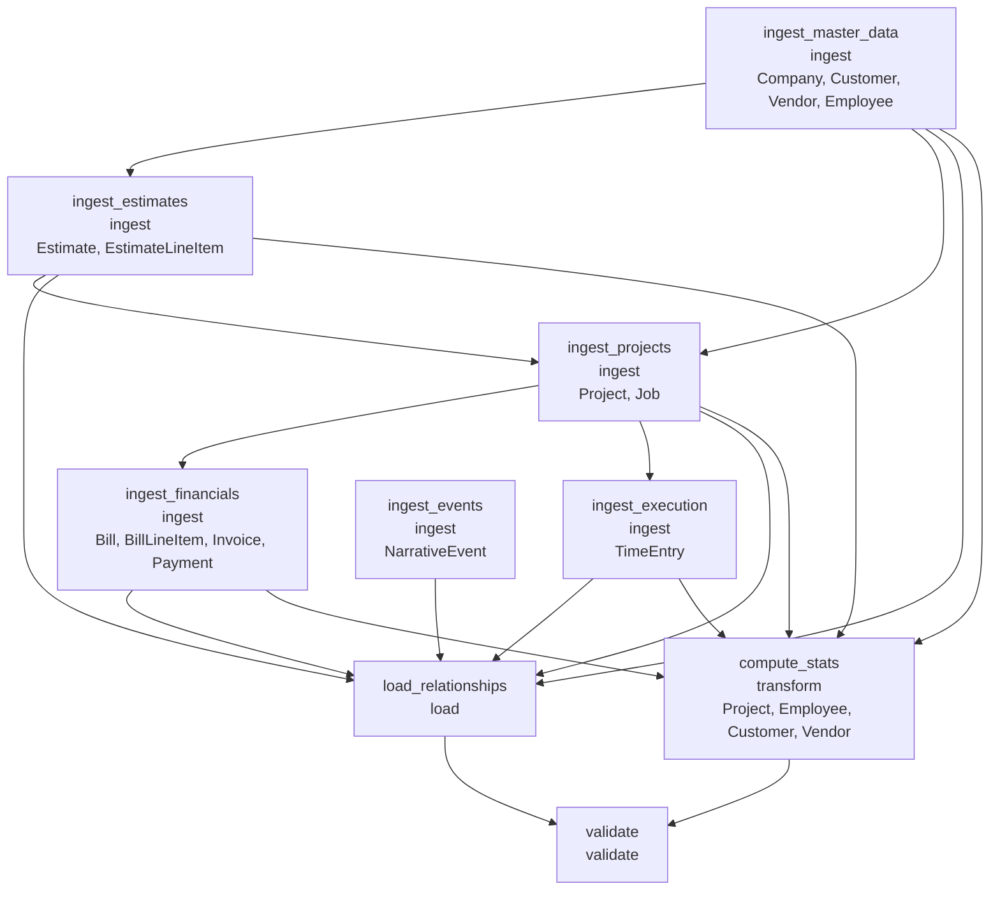

# ETL Architecture — Ridgeline Builders

Generated from `runs/ridgeline_20260318/phase_3_architecture/etl_architecture.yaml` on 2026-03-18

- **Neo4j target:** 5.x
- **Pipeline stages:** 9
- **Source pipelines:** 16

## Pipeline DAG



## Neo4j Schema

### Constraints

| Type | Label | Property |
|------|-------|----------|
| uniqueness | Company | `name` |
| uniqueness | Customer | `id` |
| uniqueness | Vendor | `id` |
| uniqueness | Employee | `id` |
| uniqueness | Estimate | `estimate_id` |
| uniqueness | EstimateLineItem | `line_id` |
| uniqueness | Project | `project_id` |
| uniqueness | Job | `job_id` |
| uniqueness | TimeEntry | `entry_id` |
| uniqueness | Bill | `bill_id` |
| uniqueness | BillLineItem | `line_id` |
| uniqueness | Invoice | `invoice_id` |
| uniqueness | Payment | `payment_id` |
| uniqueness | NarrativeEvent | `event_id` |

### Indexes

| Label | Properties | Type |
|-------|-----------|------|
| Company | `owner_name` | btree |
| Customer | `name` | btree |
| Customer | `type` | btree |
| Customer | `status` | btree |
| Customer | `created_at` | range |
| Vendor | `name` | btree |
| Vendor | `type` | btree |
| Vendor | `insurance_expiry` | range |
| Vendor | `account_opened` | range |
| Employee | `name` | btree |
| Employee | `status` | btree |
| Employee | `hire_date` | range |
| Employee | `termination_date` | range |
| Estimate | `archetype` | btree |
| Estimate | `status` | btree |
| Estimate | `created_at` | range |
| Estimate | `sent_at` | range |
| Estimate | `valid_until` | range |
| Estimate | `accepted_at` | range |
| Project | `name` | btree |
| Project | `archetype` | btree |
| Project | `type` | btree |
| Project | `status` | btree |
| Project | `start_date` | range |
| Project | `end_date` | range |
| Project | `actual_start` | range |
| Project | `actual_end` | range |
| Project | `contract_type` | btree |
| Job | `name` | btree |
| Job | `status` | btree |
| Job | `sub_vendor_type` | btree |
| Job | `actual_start` | range |
| Job | `actual_end` | range |
| TimeEntry | `date` | range |
| Bill | `status` | btree |
| Bill | `received_date` | range |
| Bill | `due_date` | range |
| Bill | `paid_date` | range |
| Invoice | `type` | btree |
| Invoice | `status` | btree |
| Invoice | `issued_date` | range |
| Invoice | `due_date` | range |
| Payment | `received_date` | range |
| Payment | `deposited_date` | range |
| NarrativeEvent | `event_type` | btree |
| NarrativeEvent | `date` | range |

## Pipeline Specifications

### Source: `381f49880b21`

- **Format:** csv
- **Upsert mode:** merge
- **On error:** quarantine
- **Produces entities:** Company
- **Produces relationships:** COMPANY_EMPLOYS
- **Preprocessing:** type_coerce

### Source: `dab846594bbb`

- **Format:** csv
- **Upsert mode:** merge
- **On error:** quarantine
- **Produces entities:** Customer
- **Preprocessing:** type_coerce → normalize

### Source: `580ea3721ca9`

- **Format:** csv
- **Upsert mode:** merge
- **On error:** quarantine
- **Produces entities:** Vendor
- **Preprocessing:** type_coerce → normalize

### Source: `78b8b8fdb27f`

- **Format:** csv
- **Upsert mode:** merge
- **On error:** quarantine
- **Produces entities:** Employee
- **Preprocessing:** type_coerce → normalize

### Source: `ce1c4e604911`

- **Format:** csv
- **Upsert mode:** merge
- **On error:** quarantine
- **Produces entities:** Estimate
- **Produces relationships:** CUSTOMER_HAS_ESTIMATE, ESTIMATE_BECOMES_PROJECT
- **Preprocessing:** type_coerce → normalize

### Source: `e03d6c5ed7d7`

- **Format:** csv
- **Upsert mode:** merge
- **On error:** quarantine
- **Produces entities:** EstimateLineItem
- **Produces relationships:** ESTIMATE_HAS_LINE_ITEM, ESTIMATE_LINE_ITEM_MAPS_TO_JOB
- **Preprocessing:** type_coerce → normalize

### Source: `7b95d9ad0f5f`

- **Format:** csv
- **Upsert mode:** merge
- **On error:** quarantine
- **Produces entities:** Project
- **Produces relationships:** CUSTOMER_HAS_PROJECT, ESTIMATE_BECOMES_PROJECT
- **Preprocessing:** type_coerce → normalize

### Source: `d8e86831c3bc`

- **Format:** csv
- **Upsert mode:** merge
- **On error:** quarantine
- **Produces entities:** Job
- **Produces relationships:** PROJECT_HAS_JOB
- **Preprocessing:** type_coerce → normalize

### Source: `a1d7892ddd7d`

- **Format:** csv
- **Upsert mode:** merge
- **On error:** quarantine
- **Produces entities:** TimeEntry
- **Produces relationships:** JOB_HAS_TIME_ENTRY, EMPLOYEE_LOGS_TIME
- **Preprocessing:** type_coerce

### Source: `3ec971acc703`

- **Format:** csv
- **Upsert mode:** merge
- **On error:** quarantine
- **Produces entities:** Bill
- **Produces relationships:** VENDOR_HAS_BILL, PROJECT_HAS_BILL, JOB_HAS_BILL
- **Preprocessing:** type_coerce → normalize

### Source: `cc08c48ce725`

- **Format:** csv
- **Upsert mode:** merge
- **On error:** quarantine
- **Produces entities:** BillLineItem
- **Preprocessing:** type_coerce → normalize

### Source: `d03c595c4b33`

- **Format:** csv
- **Upsert mode:** merge
- **On error:** quarantine
- **Produces entities:** Invoice
- **Produces relationships:** PROJECT_HAS_INVOICE
- **Preprocessing:** type_coerce → normalize

### Source: `491b7ff7ab76`

- **Format:** csv
- **Upsert mode:** merge
- **On error:** quarantine
- **Produces entities:** Payment
- **Produces relationships:** INVOICE_HAS_PAYMENT
- **Preprocessing:** type_coerce

### Source: `fadb29a0034e`

- **Format:** csv
- **Upsert mode:** merge
- **On error:** quarantine
- **Produces entities:** NarrativeEvent
- **Preprocessing:** type_coerce → type_coerce

### Source: `d17411f8d40e`

- **Format:** csv
- **Upsert mode:** merge
- **On error:** quarantine
- **Produces entities:** NarrativeEvent
- **Preprocessing:** type_coerce → type_coerce

### Source: `28104fac72b5`

- **Format:** csv
- **Upsert mode:** merge
- **On error:** quarantine
- **Produces entities:** NarrativeEvent
- **Preprocessing:** type_coerce → type_coerce

## Incremental Strategy

- **Detection method:** full_scan
- **Notes:** Full scan with MERGE ensures idempotency. For production with live connectors, switch to timestamp-based incremental using updated_at fields from source systems. The generated CSV data has no updated_at or modified_at columns, so full scan is the only viable approach for MVP.

## Simulation Integration

- **Export format:** neo4j_direct

### SDG-Compatible CSV Exports

**`employees.csv`**
```cypher
MATCH (e:Employee) RETURN e.id AS id, e.name AS name, e.role AS role, e.trade AS trade, e.status AS status, e.hire_date AS hire_date
```

**`initiatives.csv`**
```cypher
MATCH (p:Project) RETURN p.project_id AS id, p.name AS name, p.archetype AS archetype, p.status AS status, p.start_date AS start_date, p.end_date AS end_date
```

**`customers.csv`**
```cypher
MATCH (c:Customer) RETURN c.id AS id, c.name AS name, c.type AS type, c.email AS email, c.status AS status
```

### Constraint Profile Queries

**`headcount`**
```cypher
MATCH (e:Employee) WHERE e.status = 'active' RETURN count(e) AS headcount
```

**`active_projects`**
```cypher
MATCH (p:Project) WHERE p.status IN ['in_progress', 'active'] RETURN count(p) AS active_projects
```

**`total_contract_value`**
```cypher
MATCH (p:Project) RETURN sum(p.contract_amount) AS total_contract_value
```

**Notes:** Simulation integration is limited. This dataset covers operational construction data (projects, estimates, bills, time tracking), not the organizational behavior data Simulation expects (departments, performance reviews, OKRs, engagement surveys). Most Simulation entity types (Department, Initiative, PerformanceReview, EngagementSurvey) have no source data in the Ridgeline dataset. Employee maps partially (no department assignment, no manager hierarchy). Project maps loosely to Initiative but lacks strategic context. See ontology simulation_compatibility section for the full gap analysis.
