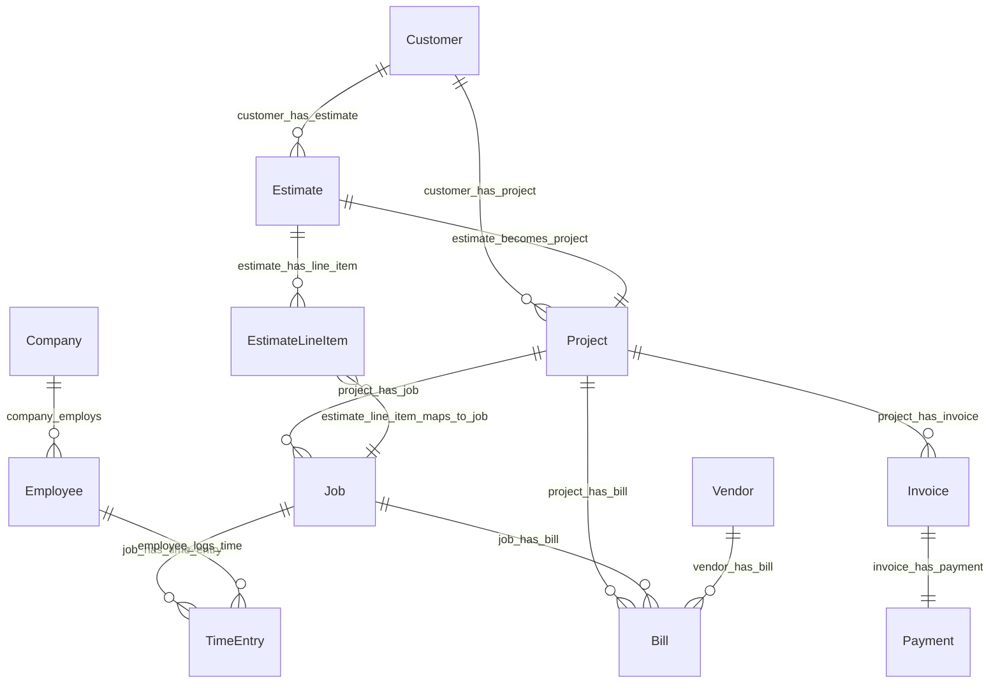

# Ontology — Ridgeline Builders

Generated from `runs/ridgeline_20260318/phase_1_ontology/ontology.yaml` on 2026-03-18

- **Entity types:** 14
- **Relationship types:** 14
- **Domain concepts:** 10

## Entity-Relationship Diagram

## Entity Types

### Company

The general contracting firm itself. Singleton record representing Ridgeline Builders, a small residential and light commercial general contractor in central Pennsylvania.

- **Identifier:** `name` (Single record — identified by company name)
- **Instance count:** 1
- **Sources:** 381f49880b21

| Property | Type | Required | Source | Description |
|----------|------|----------|--------|-------------|
| `name` | string | Yes | direct | Legal business name |
| `trade` | string | Yes | direct | Primary trade classification |
| `region` | string | Yes | direct | Geographic operating region |
| `owner_name` | string | Yes | direct | Name of the company owner |
| `owner_employee_id` | string | Yes | direct | FK to Employee entity for the owner |
| `address` | string | Yes | direct | Business mailing address |
| `phone` | string | Yes | direct | Business phone number |
| `email` | string | Yes | direct | Business email address |
| `license_number` | string | Yes | direct | State home improvement contractor license number |

### Customer

Property owners or businesses that commission construction work from Ridgeline Builders. Mix of residential homeowners and commercial tenants in central Pennsylvania.

- **Identifier:** `id` (CUST-NNN sequential (CUST-001 through CUST-013))
- **Instance count:** 13
- **Sources:** dab846594bbb
- **Lifecycle states:** active

| Property | Type | Required | Source | Description |
|----------|------|----------|--------|-------------|
| `id` | string | Yes | direct | Unique customer identifier |
| `name` | string | Yes | direct | Customer name (individual or couple) |
| `email` | string | Yes | direct | Customer email address |
| `phone` | string | Yes | direct | Customer phone number |
| `address` | string | Yes | direct | Customer property or mailing address |
| `payment_terms` | string | Yes | direct | Negotiated payment terms (net_15, net_30, net_45, due_on_receipt) |
| `source` | string | Yes | direct | How the customer was acquired (referral, repeat, google, yard_sign, direct_outreach) |
| `type` | string | Yes | direct | Customer classification — residential or commercial |
| `tax_exempt` | boolean | Yes | direct | Whether the customer is tax-exempt |
| `credit_limit` | float | Yes | direct | Customer credit limit (0 for all in current data) |
| `status` | string | Yes | direct | Customer status (active) |
| `created_at` | date | Yes | direct | Date the customer record was created |
| `notes` | string | No | direct | Free-text notes about the customer (92.3% null) |

### Vendor

External parties that provide materials, subcontract labor, equipment rental, or professional services to Ridgeline Builders. Kept as a single type with vendor_type property to distinguish roles. See decision D_1001.

- **Identifier:** `id` (VEN-NNN sequential (VEN-001 through VEN-010))
- **Instance count:** 10
- **Sources:** 580ea3721ca9

| Property | Type | Required | Source | Description |
|----------|------|----------|--------|-------------|
| `id` | string | Yes | direct | Unique vendor identifier |
| `name` | string | Yes | direct | Vendor business name |
| `type` | string | Yes | direct | Vendor role classification (supplier, subcontractor, equipment_rental, professional_service) |
| `trade` | string | No | direct | Trade specialty (general, electrical, plumbing, hvac, tile, countertops). 20% null. |
| `contact` | string | No | direct | Primary contact person name. 10% null. |
| `phone` | string | No | direct | Vendor phone number. 10% null. |
| `email` | string | No | direct | Vendor email address. 10% null. |
| `payment_terms` | string | Yes | direct | Payment terms (net_30, net_15, due_on_receipt) |
| `tax_id` | string | No | direct | Federal tax ID (EIN). 10% null. |
| `w9_on_file` | boolean | Yes | direct | Whether a W-9 form is on file |
| `insurance_expiry` | date | No | direct | Insurance certificate expiration date. 50% null (suppliers without insurance tracking). |
| `rating` | float | No | direct | Vendor quality rating (3.0-5.0 scale). 10% null. |
| `credit_limit` | float | No | direct | Vendor credit limit. 90% null. |
| `account_opened` | date | No | direct | Date vendor account was opened. 90% null. |

### Employee

W-2 employees of Ridgeline Builders. Includes the owner, field crew (foreman, journeymen), and potentially office staff. The data shows 5 employees with a reference to EMP-006 in narrative events.

- **Identifier:** `id` (EMP-NNN sequential (EMP-001 through EMP-005))
- **Instance count:** 5
- **Sources:** 78b8b8fdb27f
- **Lifecycle states:** active, terminated

| Property | Type | Required | Source | Description |
|----------|------|----------|--------|-------------|
| `id` | string | Yes | direct | Unique employee identifier |
| `name` | string | Yes | direct | Employee full name |
| `role` | string | Yes | direct | Job role (owner, foreman, journeyman) |
| `trade` | string | Yes | direct | Trade classification (all general in current data) |
| `base_rate` | float | Yes | direct | Hourly base pay rate. Owner has 0.0 (does not draw hourly wage). |
| `burden_rate` | float | Yes | direct | Fully burdened hourly cost (base + taxes, insurance, benefits) |
| `bill_rate` | float | Yes | direct | Hourly rate charged to customers for this employee |
| `status` | string | Yes | direct | Employment status (active, terminated) |
| `hire_date` | date | Yes | direct | Date of hire |
| `termination_date` | date | No | direct | Date of termination. 80% null (only terminated employees). |

### Estimate

Proposals sent to customers for construction work. Each estimate has a project archetype, line items, and a won/lost lifecycle. Accepted estimates convert into Projects.

- **Identifier:** `estimate_id` (EST-XXXXXXXX UUID (e.g., EST-4F32A47F) with sequential EST-NNNN number)
- **Instance count:** 100
- **Sources:** ce1c4e604911
- **Lifecycle states:** sent, accepted, declined, expired

| Property | Type | Required | Source | Description |
|----------|------|----------|--------|-------------|
| `estimate_id` | string | Yes | direct | Unique estimate identifier (UUID-based) |
| `estimate_number` | string | Yes | direct | Sequential human-readable estimate number (EST-0001) |
| `version` | integer | Yes | direct | Estimate version (all version 1 in current data) |
| `customer_id` | string | Yes | direct | FK to Customer entity |
| `archetype` | string | Yes | direct | Project archetype classification (7 types) |
| `status` | string | Yes | direct | Estimate lifecycle status (accepted, expired, declined, sent) |
| `scope_description` | string | Yes | direct | Description of work scope |
| `exclusions` | string | Yes | direct | Work excluded from the estimate |
| `assumptions` | string | Yes | direct | Assumptions underlying the estimate |
| `total` | float | Yes | direct | Total estimate price to customer |
| `cost_estimate` | float | Yes | direct | Estimated cost to Ridgeline (before markup) |
| `markup_pct` | float | Yes | direct | Markup percentage over estimated cost |
| `tax_amount` | float | Yes | direct | Tax amount (0.0 in all current data) |
| `created_at` | date | Yes | direct | Date the estimate was created |
| `sent_at` | date | Yes | direct | Date the estimate was sent to the customer |
| `valid_until` | date | Yes | direct | Expiration date of the estimate |
| `accepted_at` | date | No | direct | Date the estimate was accepted. 49% null (non-accepted estimates). |
| `project_id` | string | No | direct | FK to Project entity. 49% null (only accepted estimates have projects). |

### EstimateLineItem

Individual cost-code-level line items within an estimate. Each line represents a specific scope of work (demolition, framing, electrical, etc.) with estimated cost and price.

- **Identifier:** `line_id` (ELI-XXXXXXXX UUID (e.g., ELI-74BF9B68))
- **Instance count:** 1173
- **Sources:** e03d6c5ed7d7

| Property | Type | Required | Source | Description |
|----------|------|----------|--------|-------------|
| `line_id` | string | Yes | direct | Unique line item identifier |
| `estimate_id` | string | Yes | direct | FK to parent Estimate entity |
| `cost_code` | string | Yes | direct | Cost code identifier (e.g., 01-LABOR, 03-FRAMING). Links to Job.code. |
| `description` | string | Yes | direct | Human-readable description of the line item |
| `quantity` | integer | Yes | direct | Quantity (always 1 in current data — lump sum) |
| `unit` | string | Yes | direct | Unit of measure (always ls/lump sum in current data) |
| `unit_cost` | float | Yes | direct | Estimated cost per unit to Ridgeline |
| `unit_price` | float | Yes | direct | Price per unit charged to customer |
| `line_total` | float | Yes | direct | Total line item price (quantity * unit_price) |
| `category` | string | Yes | direct | Cost category (labor, material, subcontractor) |

### Project

Active construction projects created from accepted estimates. The central hub entity linking jobs, bills, invoices, payments, and time entries. Each project has a type, archetype, site address, contract amount, and date range.

- **Identifier:** `project_id` (PROJ-XXXXXXXX UUID (e.g., PROJ-30C2FC8F))
- **Instance count:** 51
- **Sources:** 7b95d9ad0f5f
- **Lifecycle states:** complete

| Property | Type | Required | Source | Description |
|----------|------|----------|--------|-------------|
| `project_id` | string | Yes | direct | Unique project identifier |
| `estimate_id` | string | Yes | direct | FK to the originating Estimate |
| `customer_id` | string | Yes | direct | FK to Customer entity |
| `name` | string | Yes | direct | Project name (typically CustomerLastName — ArchetypeDescription) |
| `archetype` | string | Yes | direct | Project archetype (7 types matching estimate archetypes) |
| `type` | string | Yes | direct | Project type classification (repair, renovation, addition, new_construction, tenant_improvement) |
| `trade` | string | Yes | direct | Trade classification (all general in current data) |
| `status` | string | Yes | direct | Project status (all complete in historical data) |
| `site_address` | string | Yes | direct | Physical address of the construction site |
| `start_date` | date | Yes | direct | Planned start date |
| `end_date` | date | Yes | direct | Planned end date |
| `actual_start` | date | Yes | direct | Actual start date |
| `actual_end` | date | Yes | direct | Actual end date |
| `contract_amount` | float | Yes | direct | Total contract value |
| `contract_type` | string | Yes | direct | Contract type (all fixed_price in current data) |
| `markup_pct` | float | Yes | direct | Markup percentage on estimated cost |
| `retention_pct` | float | Yes | direct | Retention percentage held (5% or 10%) |
| `retention_released` | boolean | Yes | direct | Whether retention has been released |
| `permit_required` | boolean | Yes | direct | Whether a building permit is required |
| `permit_number` | string | No | direct | Building permit number. 70.6% null (not all projects need permits). |

### Job

Cost codes within a project representing distinct scopes of work (demolition, framing, electrical, plumbing, etc.). Each job tracks budgeted costs by category and actual dates. Jobs are the cost allocation unit for time entries and bills.

- **Identifier:** `job_id` (JOB-XXXXXXXX UUID (e.g., JOB-10476A34))
- **Instance count:** 279
- **Sources:** d8e86831c3bc
- **Lifecycle states:** complete

| Property | Type | Required | Source | Description |
|----------|------|----------|--------|-------------|
| `job_id` | string | Yes | direct | Unique job identifier |
| `project_id` | string | Yes | direct | FK to parent Project entity |
| `code` | string | Yes | direct | Cost code (e.g., 01-DEMO, 03-FRAMING). Links to EstimateLineItem.cost_code. |
| `name` | string | Yes | direct | Human-readable name of the cost code |
| `budgeted_labor_hours` | float | Yes | direct | Budgeted labor hours for this job |
| `budgeted_labor_cost` | float | Yes | direct | Budgeted labor cost |
| `budgeted_material_cost` | float | Yes | direct | Budgeted material cost |
| `budgeted_sub_cost` | float | Yes | direct | Budgeted subcontractor cost |
| `budgeted_equipment_cost` | float | Yes | direct | Budgeted equipment cost (always 0.0 in current data) |
| `budgeted_other_cost` | float | Yes | direct | Budgeted other cost (always 0.0 in current data) |
| `status` | string | Yes | direct | Job status (all complete in historical data) |
| `sort_order` | integer | Yes | direct | Display sort order within the project |
| `sub_vendor_type` | string | No | direct | Trade specialty for subcontractor jobs (plumbing, electrical, hvac, tile, countertops). 77% null. |
| `equipment_needed` | boolean | Yes | direct | Whether the job requires equipment rental |
| `actual_start` | date | Yes | direct | Actual start date of the job |
| `actual_end` | date | Yes | direct | Actual end date of the job |

### TimeEntry

Daily time records for crew members working on specific jobs. Tracks regular and overtime hours separately with computed labor cost.

- **Identifier:** `entry_id` (TE-XXXXXXXX UUID (e.g., TE-65D1FA0D))
- **Instance count:** 1710
- **Sources:** a1d7892ddd7d

| Property | Type | Required | Source | Description |
|----------|------|----------|--------|-------------|
| `entry_id` | string | Yes | direct | Unique time entry identifier |
| `employee_id` | string | Yes | direct | FK to Employee entity |
| `project_id` | string | Yes | direct | FK to Project entity |
| `job_id` | string | Yes | direct | FK to Job entity |
| `date` | date | Yes | direct | Date of the time entry |
| `hours_regular` | float | Yes | direct | Regular hours worked |
| `hours_overtime` | float | Yes | direct | Overtime hours worked |
| `cost` | float | Yes | computed | Computed labor cost for this entry |
| `notes` | string | Yes | direct | Description of work performed |

### Bill

Vendor invoices received by Ridgeline Builders. Includes both project-related bills (materials, subcontractors) and overhead bills (rent, utilities, insurance). All historical bills are paid.

- **Identifier:** `bill_id` (BILL-XXXXXXXX UUID (e.g., BILL-B7EBAB84))
- **Instance count:** 745
- **Sources:** 3ec971acc703
- **Lifecycle states:** paid

| Property | Type | Required | Source | Description |
|----------|------|----------|--------|-------------|
| `bill_id` | string | Yes | direct | Unique bill identifier |
| `vendor_id` | string | Yes | direct | FK to Vendor entity |
| `project_id` | string | No | direct | FK to Project entity. 22.8% null for overhead bills. |
| `job_id` | string | No | direct | FK to Job entity. 22.8% null for overhead bills. |
| `vendor_invoice_number` | string | Yes | direct | Vendor's own invoice number |
| `status` | string | Yes | direct | Bill payment status (all paid in historical data) |
| `received_date` | date | Yes | direct | Date the bill was received |
| `due_date` | date | Yes | direct | Payment due date |
| `total` | float | Yes | direct | Total bill amount |
| `paid_date` | date | Yes | direct | Date the bill was paid |
| `payment_method` | string | Yes | direct | Payment method (check, ach) |
| `check_number` | integer | No | direct | Check number for check payments. 24.2% null (ACH payments). |
| `category` | string | Yes | direct | Spend category (material, subcontractor, rent, vehicles, utilities, software, insurance, tools) |

### BillLineItem

Line-item detail on vendor bills. In current data there is a 1:1 relationship with bills (single line item per bill), but the separate entity preserves the project/job-level cost allocation granularity. See decision D_1003.

- **Identifier:** `line_id` (BLI-XXXXXXXX UUID (e.g., BLI-8F3D1502))
- **Instance count:** 745
- **Sources:** cc08c48ce725

| Property | Type | Required | Source | Description |
|----------|------|----------|--------|-------------|
| `line_id` | string | Yes | direct | Unique line item identifier |
| `bill_id` | string | Yes | direct | FK to parent Bill entity |
| `project_id` | string | No | direct | FK to Project entity. 22.8% null for overhead bills. |
| `job_id` | string | No | direct | FK to Job entity. 22.8% null for overhead bills. |
| `description` | string | Yes | direct | Description of the billed item or service |
| `quantity` | integer | Yes | direct | Quantity (always 1 in current data — lump sum) |
| `unit_cost` | float | Yes | direct | Cost per unit |
| `line_total` | float | Yes | direct | Total line item amount (quantity * unit_cost) |
| `category` | string | Yes | direct | Spend category matching bill header |

### Invoice

Customer-facing invoices issued by Ridgeline Builders for project work. Supports progress billing, final invoices, and retention release invoices.

- **Identifier:** `invoice_id` (INV-XXXXXXXX UUID (e.g., INV-04F11446) with sequential INV-NNNN number)
- **Instance count:** 134
- **Sources:** d03c595c4b33
- **Lifecycle states:** paid

| Property | Type | Required | Source | Description |
|----------|------|----------|--------|-------------|
| `invoice_id` | string | Yes | direct | Unique invoice identifier (UUID-based) |
| `invoice_number` | string | Yes | direct | Sequential human-readable invoice number (INV-0001) |
| `project_id` | string | Yes | direct | FK to Project entity |
| `customer_id` | string | Yes | direct | FK to Customer entity |
| `type` | string | Yes | direct | Invoice type (progress, final, retention) |
| `status` | string | Yes | direct | Invoice status (all paid in historical data) |
| `issued_date` | date | Yes | direct | Date the invoice was issued |
| `due_date` | date | Yes | direct | Payment due date |
| `subtotal` | float | Yes | direct | Invoice subtotal before retention and tax |
| `retention_held` | float | Yes | direct | Amount of retention withheld from this invoice |
| `tax` | float | Yes | direct | Tax amount (0.0 in all current data) |
| `total_due` | float | Yes | direct | Net amount due (subtotal - retention_held + tax) |

### Payment

Customer payments received against invoices. 1:1 relationship with invoices in current data (every invoice is fully paid with one payment).

- **Identifier:** `payment_id` (PAY-XXXXXXXX UUID (e.g., PAY-07250858))
- **Instance count:** 134
- **Sources:** 491b7ff7ab76

| Property | Type | Required | Source | Description |
|----------|------|----------|--------|-------------|
| `payment_id` | string | Yes | direct | Unique payment identifier |
| `invoice_id` | string | Yes | direct | FK to Invoice entity |
| `project_id` | string | Yes | direct | FK to Project entity |
| `customer_id` | string | Yes | direct | FK to Customer entity |
| `amount` | float | Yes | direct | Payment amount |
| `method` | string | Yes | direct | Payment method (ach, check, credit_card) |
| `reference` | string | Yes | direct | Payment reference number (check number, transaction ID) |
| `received_date` | date | Yes | direct | Date the payment was received |
| `deposited_date` | date | Yes | direct | Date the payment was deposited |

### NarrativeEvent

Business events that affect operations but are not captured in transactional data. Includes line-of-credit draws, overtime mandates, and pricing changes. Modeled as a single flexible type with event_type discriminator. See decision D_1002.

- **Identifier:** `event_id` (EVT-NNN sequential (EVT-003, EVT-014, EVT-018))
- **Instance count:** 3
- **Sources:** fadb29a0034e, d17411f8d40e, 28104fac72b5

| Property | Type | Required | Source | Description |
|----------|------|----------|--------|-------------|
| `event_id` | string | Yes | direct | Unique event identifier |
| `event_type` | string | Yes | inferred | Type of narrative event (loc_draw, overtime_mandate, pricing_change). Inferred from source file. |
| `date` | date | Yes | direct | Event date or effective date (mapped from date, start_date, or effective_date depending on source) |
| `description` | string | Yes | direct | Human-readable description of the event |
| `amount` | float | No | direct | Monetary amount associated with the event (loc_draw only) |
| `event_metadata` | string | No | inferred | JSON-encoded event-specific fields that vary by event_type |

## Relationship Types

| Relationship | From | To | Cardinality | Method | Confidence |
|-------------|------|-----|------------|--------|-----------|
| `customer_has_estimate` | Customer | Estimate | 1:N | explicit_fk | 1.0 |
| `customer_has_project` | Customer | Project | 1:N | explicit_fk | 1.0 |
| `estimate_becomes_project` | Estimate | Project | 1:1 | explicit_fk | 1.0 |
| `estimate_has_line_item` | Estimate | EstimateLineItem | 1:N | explicit_fk | 1.0 |
| `project_has_job` | Project | Job | 1:N | explicit_fk | 1.0 |
| `project_has_invoice` | Project | Invoice | 1:N | explicit_fk | 1.0 |
| `project_has_bill` | Project | Bill | 1:N | explicit_fk | 1.0 |
| `job_has_time_entry` | Job | TimeEntry | 1:N | explicit_fk | 0.792 |
| `job_has_bill` | Job | Bill | 1:N | explicit_fk | 0.829 |
| `employee_logs_time` | Employee | TimeEntry | 1:N | explicit_fk | 0.86 |
| `vendor_has_bill` | Vendor | Bill | 1:N | explicit_fk | 0.93 |
| `invoice_has_payment` | Invoice | Payment | 1:1 | explicit_fk | 1.0 |
| `company_employs` | Company | Employee | 1:N | explicit_fk | 0.44 |
| `estimate_line_item_maps_to_job` | EstimateLineItem | Job | N:1 | explicit_fk | 1.0 |

## Domain Concepts

| Concept | Entity Type | Definition |
|---------|------------|------------|
| **project_archetype** | Project | A classification of construction projects by the nature and scale of work. Archetypes drive estimate templates, cost code selections, and expected margin profiles. Values: repair_service, bathroom_remodel, kitchen_remodel, deck_addition, room_addition, new_construction, tenant_improvement |
| **project_type** | Project | A higher-level grouping of project archetypes into construction work categories. Derived from archetype but at a coarser grain. Values: repair, renovation, addition, new_construction, tenant_improvement |
| **vendor_type** | Vendor | The role a vendor plays in Ridgeline's supply chain. Determines the nature of the business relationship and billing patterns. Values: supplier, subcontractor, equipment_rental, professional_service |
| **employee_role** | Employee | The job function of an employee within Ridgeline Builders. Determines pay rates, bill rates, and crew hierarchy. Values: owner, foreman, journeyman, apprentice, office_admin |
| **estimate_status** | Estimate | The lifecycle state of an estimate, tracking it from creation through customer decision. Values: sent, accepted, declined, expired |
| **payment_terms** | Customer | The agreed timeframe for payment between Ridgeline and its customers or vendors. Applied at the customer and vendor level. Values: net_15, net_30, net_45, due_on_receipt |
| **customer_type** | Customer | Classification of customers by the type of property or business relationship. Affects project scope, permitting, and billing patterns. Values: residential, commercial |
| **customer_source** | Customer | The acquisition channel through which a customer was obtained. Tracks marketing effectiveness and referral network strength. Values: referral, repeat, google, yard_sign, direct_outreach |
| **contract_type** | Project | The pricing structure of the construction contract between Ridgeline and the customer. Values: fixed_price |
| **bill_category** | Bill | Classification of vendor bills by the type of expense. Used for cost analysis and job costing. Values: material, subcontractor, equipment, rent, vehicles, utilities, software, insurance, tools |

## Simulation Compatibility

### Matched Node Types

| Ontology Type | Simulation Type |
|-------------|----------------|
| Employee | Person |
| Customer | Customer |
| Project | Initiative |

### Unmapped Ontology Types

- Company
- Vendor
- Estimate
- EstimateLineItem
- Job
- TimeEntry
- Bill
- BillLineItem
- Invoice
- Payment
- NarrativeEvent

### Missing Simulation Types (expected but not in data)

- Department
- System
- Process
- Covenant
